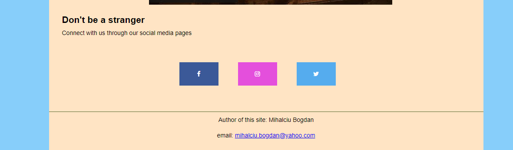

# Bucovina

## Purpose

The purpose of this application is to help promote the travel services of 4 funky tour guides in the Bucovina region(Romania), each of them having distinct key roles. Also as a secondary objective the website could serve as an info point for tourist that travel to Bucovina and would like to know more about the places of interest in the region.

## Features

### Existing features

#### 1. Home page

On the landing page we have the hero image, a photo of a valley in Bucovina covered in fog. I chose this photo because it is emblematic for the beatifull landscapes of Bucovina and so it supports the purpose of the website. For this reason and for consistency I chose to display this image on all 5 pages of the website.
Right below the hero image we have the navigation bar, the *About Us* section and the *About Bucovina* section.

**Navigation Bar**

The navigation bar consists of 5 buttons displayed horizontally on resolutions greater than 900px and vertically for lower resolutions. 

1. Home
2. Places of interest
3. Tours schedule
4. Bookings
5. Contact us

**About us**

The "About Us" section consists of a photo of the 4 tour guides and a short description of their roles. On lower resolutions the photo is stacked on top of the tour guides description.

**About Bucovina**

In this section I gave a brief description of Bucovina providing 3 more photos that encapsulate the beauty of nature and simple life-style and a historical map of the province. 
Apart from the stunning landscape photos the key aspect of this section is the video about Bucovina taken from the youtube channel called [FramingReality](https://www.youtube.com/@FramingReality).

**Footer**

The footer contains social media buttons and my email address. The footer is present on each page for a plus of consistency.

#### 2.Places of interest page

On the second page called Places of interest we have the following features:

1. Accomodations
2. Monasteries and museums
3. Natural landmarks

**1. Accomodations**

In this sections there are a few recommandations for hotels and B&B's with links to their page on the [Bookings.com](wwww.bookings.com.)
I have used [Bitly](https://bitly.com/) to shorten the external links to [Bookings.com](wwww.bookings.com.)

**2. Monasteries and museums**

In this section there are photos and links to [Wikipedia](www.wikipedia.org)(for Voronet and Putna Monasteries) or to [Muzee de la sat](https://muzeedelasat.ro/) for Cacia Salt Mine and to [Explore Bucovina](https://explorebucovina.com/the-bukovina-village-museum/) for the Village Museum. All the links are opening in a new tab and have the "aria-label" attribute set.

 

**3. Natural landmarks**

In this section, styled like the above Monasteries section we can find other atractions that the web application is set to promote. The external links used in this section are as follows:

* [Wikipedia](www.wikipedia.org) for : 

    + "The stones of the Lady" landmark
    + Suceava castle
    + Bicaz canyon
                                      
* [Mocanita](https://mocanitamoldovita.com/) for the *Mocanita* lumber train
* [The Campulung Moldovenesc city website](https://campulungmoldovenesc.ro/descopera/cheile-moara-dracului) for the Devil's Mill passage

The photos on this page are nested in the anchor tag so that when clicked the browser opens the mentioned links in new tabs.

#### 3. Tour schedule page

This page has 2 sections, one is for the Historical tour and the other one is for the Trails and salt mine tour. The *Historical tour* is set to promote the Monasteries and Museums presented in the Places of interest page, whereas the *Trails and salt mine tour* is a nature oriented experience and promotes the landmarks from the previous webpage.

Both sections consists of a schedule table, the price for each tour, a *price breakdown* section and a button that sends the user to the Bookings page.

To improve responsiveness, I chose not to display the *Duration* column on displays with a resolution lower than 550px.

#### 4.Bookings page

This page contains the Booking form which is separated in 2 sections. One is for the user details and the other one is called tour details. I have also assigned, using the radio inputs and textarea, a section where users can specify if they have special needs (for example they need someone that knows sign language). 
Also the *Age Group* section collects the information so that the tour guides know the average age of the group in order to tailor the experience.

All the inputs are required and they all have the appropriate type attribute assinged.

 

#### 5. Contact Us

This page contains the contact information like phone numbers and email address and also a form for users to leave a message. To maintain consistency I have used the same styling for the *Send* button like the one on the Tour schedule page changing only its position.

### Features Left to Implement

* Photo gallery
* Testimonials sections
* Bicaz canyon tour

### Testing

I have tested my application using the following browsers:
+ Chrome
+ Mozzila Firefox
+ Microsoft

I can confirm that all external links work, open in a new tab and have aria-label attribute set. Also the video attached on the Home page does not autoplay and the user has control over it.

#### Bugs

While building the application I have encountered a few bugs one and the most important was the one encountered while trying to load the video. Initially I used the video tag but after a session with my Code Institute mentor I decided to use the iframe element for both the video and a google map on the *Contact Us* page. The problem was that the content in the iframe element was not loading and the error in this case was *Google refused to load the page*. 

Doing some research I found out that there is a *Content Security Policy* in place that prevents the browser to load the content and I would have to add a meta tag in the header of the html files.

After applying the meta tag in the header of the html files the browser was refusing to load my hero image.

My mentor saved me by showing me that I can take the embeded content in html format from the source. Thank you Derek <3

#### Validator Testing

I can cofirm that my code passed throgugh the official W3C validator 

I can cofirm that my code passed throgugh the  official Jigsaw validator

#### Accesibility

### Deployment

This section should describe the process you went through to deploy the project to a hosting platform (e.g. GitHub)

+ The site was deployed to GitHub pages. The steps to deploy are as follows:
    * In the GitHub repository, navigate to the Settings tab
    * From the source section drop-down menu, select the Master Branch
    * Once the master branch has been selected, the page will be automatically refreshed with a detailed ribbon display to indicate the successful deployment.
    
    
The live link can be found here - [https://fantalm.github.io/Bucovina/index.html](https://fantalm.github.io/Bucovina/index.html)

 

